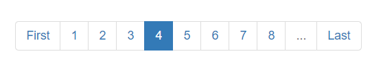

# Pagination for express, mongodb & EJS Template

### Screenshot:



## Instructions

First clone this repository.

```bash
$ git clone https://github.com/sakilk130/pagination-express-mongodb-ejs.git
```

Install dependencies. Make sure you already have [`nodejs`](https://nodejs.org/en/) & [`npm`](https://www.npmjs.com/) installed in your system.

```bash
$ npm install # or yarn
```

Run it

```bash
$ npm start # or yarn start
```

## Built with

- Express.js
- MongoDB
- EJS Template
